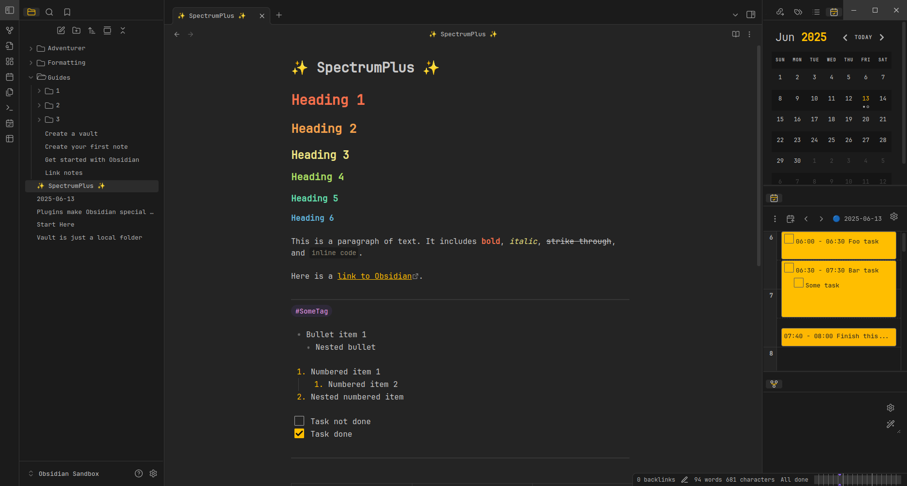

<h1 align="center">✨ SpectrumPlus ✨</h1>



<h2 align="center">Notice</h2>
<p align="center">
SpectrumPlus is a fork of the <a href="https://github.com/wiktoriavh/Spectrum">Spectrum Theme</a>, maintained independently with bug fixes, new features, and improvements since the original author is no longer maintaining it.
</p>

## About SpectrumPlus

- [Features](#Features)
- [Contributing](#Contributing)
  - [Get Started](#Get-Started)
  - [How to compile](#How-to-compile)
- [Original Author](#Original-Author)
- [License](#License)
- [✨ Release Notes](https://github.com/anotherlusitano/SpectrumPlus/releases)


## Features
<!-- Until I don't create a wiki, let's just redirect to the original wiki -->
You can see all the features on the original Wiki.

--> https://github.com/Braweria/Spectrum/wiki

## Contributing

Contributions, issues and feature requests are welcome!

Feel free to check the [issues page](https://github.com/anotherlusitano/SpectrumPlus/issues).

If you'd like to contribute financially, you can [tip the original author](https://ko-fi.com/braweria) in appreciation of their work, or [support me](https://ko-fi.com/anotherlusitano) as I continue to maintain and improve this theme. 🙏

Show your support with a ⭐️ if you enjoy the theme!

### Get started 

```sh
git clone https://github.com/anotherlusitano/SpectrumPlus.git
cd SpectrumPlus
yarn
```

### How to compile

SpectrumPlus uses [esbuild](https://esbuild.github.io) to build and compile all styles into a minified version, making the filesize smaller.

**For development**

This will build the CSS file into the `/development/spectrum-testing.css`, which is ignored by git.

```sh
yarn dev
```

**For building**

When you're done working, make a PR and if it gets accepted and merged, autiomation will kick in and build a new CSS file.

## Original Author

👩‍💻 **Wiktoria Mielcarek**

* [Twitter](https://twitter.com/braweria)
* [GitHub](https://github.com/Braweria)
* [LinkedIn](https://linkedin.com/in/wiktoria-mielcarek)

## License

Copyright © 2022 [Wiktoria Mielcarek](https://github.com/Braweria).

This project is [MIT](https://github.com/Braweria/Spectrum/blob/master/LICENSE) licensed.
